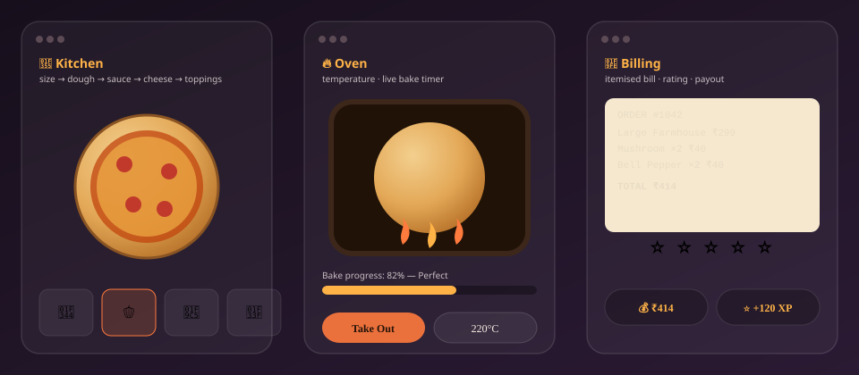

<div align="center">



<p>
  
  
  
  
  
</p>

<h3>🍕 Take the order → build it right → bake it perfect → deliver on time 🍕</h3>

</div>

---

## 🎮 Live Preview

<div align="center">

</div>

<p align="center"><sub>Every layer above is real, animated markup — not a screenshot — the same style the game itself uses.</sub></p>

---

## 📖 About

**Pizza House** is a from-scratch redesign of a simple ingredient-picker
into a full **Pizza Chef Simulator**. You greet a random customer, build
their exact order in the kitchen, bake it in a live oven, cut and pack the
box, print their name on it, and get paid based on how well you did —
all in plain HTML, CSS and JavaScript, no frameworks, no build step.

```
 CUSTOMER ORDER → KITCHEN → OVEN → CUTTING & PACKING → BILLING → ⭐ RATING → NEXT ORDER
```

---

## ✨ Features

| Stage | What happens |
|---|---|
| 🎫 **Order** | A random customer, personality, pizza type, size, and required toppings are generated onto a receipt-style ticket |
| 🥣 **Dough** | Stretch-the-slider mini-game — land in the target zone or get *"Uneven Dough!"* |
| 🍅 **Sauce** | Click-and-drag to paint sauce directly onto the pizza; live coverage % and rating |
| 🧀 **Cheese** | Mozzarella, Cheddar, or Cheese Burst |
| 🌶️ **Toppings** | 14 toppings, drag-and-drop **or** tap-to-place, each capped and removable |
| 🔥 **Oven** | Pick a real temperature, watch a live bake meter, golden → crispy → **burnt**, with a flashing burn warning |
| 🔪 **Cutting** | 4 / 6 / 8 / 10 slice options with an animated cut overlay |
| 📦 **Packing** | Napkins, sauce packet, sticker, and a name-printing animation onto the box label |
| 🧾 **Billing** | Itemised bill, 4-factor rating (accuracy / bake / packaging / speed), stars, payout, confetti |
| 🏆 **Progress** | Money, XP, chef level & title, high score, average rating, and unlockable achievements — all saved automatically |

---

## 📁 Folder Structure

```text
pizza-chef-game/
│
├── index.html              → main menu & restaurant dashboard
├── kitchen.html             → size · dough · sauce · cheese · toppings
├── oven.html                → live baking mini-game
├── packing.html              → cutting, packing checklist, name printing
├── billing.html              → itemised bill, rating & payout
├── README.md
│
├── css/
│   ├── style.css              → design tokens, shared components, menu styling
│   ├── animations.css          → shared keyframes (confetti, steam, toasts…)
│   ├── kitchen.css
│   ├── oven.css
│   ├── packing.css
│   └── billing.css
│
├── js/
│   ├── ingredients.js          → every recipe / price / point value, in one place
│   ├── storage.js             → localStorage save file + achievements
│   ├── customer.js            → random customer & order generation
│   ├── scoring.js             → accuracy · bake · rating · payout maths
│   ├── audio.js               → safe, optional sound manager (never throws)
│   ├── ui.js                  → shared toasts & confetti helpers
│   ├── game.js                → index.html logic
│   ├── kitchen.js              → kitchen.html logic
│   ├── oven.js                → oven.html logic
│   ├── packing.js              → packing.html logic
│   └── billing.js              → billing.html logic
│
├── images/
│   ├── banner.svg              → animated hero banner (this README)
│   └── preview.svg             → animated screen preview (this README)
│
└── audio/                     → optional — drop matching .mp3 files in to enable sound
```

---

## 🚀 Getting Started

No installation, no dependencies.

```bash
# 1. unzip / copy the pizza-chef-game folder anywhere

# 2. open it directly
open index.html          # or just double-click it

# — or serve it locally for the smoothest experience —
cd pizza-chef-game
python3 -m http.server 8080
# then visit http://localhost:8080
```

---

## 🧭 Game Flow

```text
index.html
   │  New Order → Start Cooking
   ▼
kitchen.html   size → dough → sauce → cheese → toppings
   │  Send to Oven
   ▼
oven.html      pick temperature → bake in real time → take it out
   │  Continue to Cutting
   ▼
packing.html    cut slices → pack box → print customer name
   │  Close Box & Continue
   ▼
billing.html    bill → rating → money + XP → achievements
   │  Next Order
   └──────────────► back to index.html
```

---

## 🔊 Adding real art & sound

The pizza, oven and box are drawn entirely with CSS + emoji so the game
works with **zero** external assets out of the box — nothing to break,
nothing to 404.

To upgrade it:
- Drop PNGs into `images/` and swap the relevant CSS background / emoji for an ``.
- Drop MP3s into `audio/` using the exact names in `js/audio.js`
  (`click`, `topping`, `sauce`, `cheese`, `oven-open`, `oven-close`,
  `baking`, `success`, `packing`, `delivery`, `game-over`).
  `AudioManager.play()` silently does nothing if a file is missing, so
  you can add them one at a time with zero console errors.


<div align="center">
<sub>Built with 🔥, 🍕 and vanilla JavaScript.</sub>
</div>
